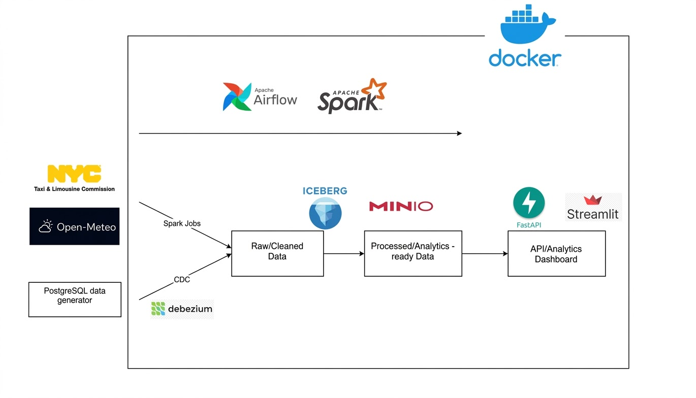
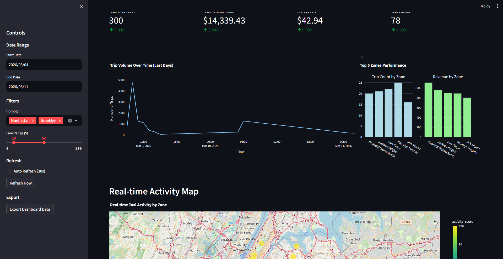
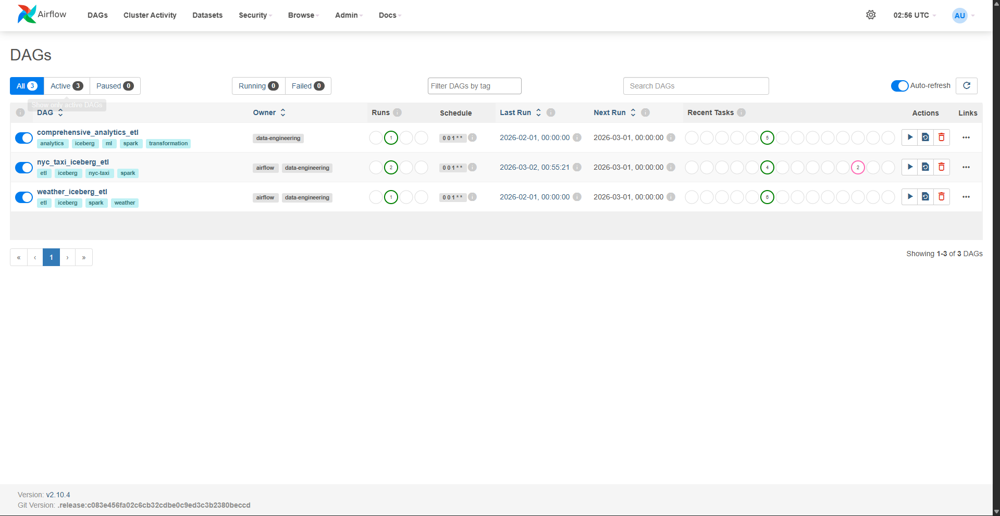
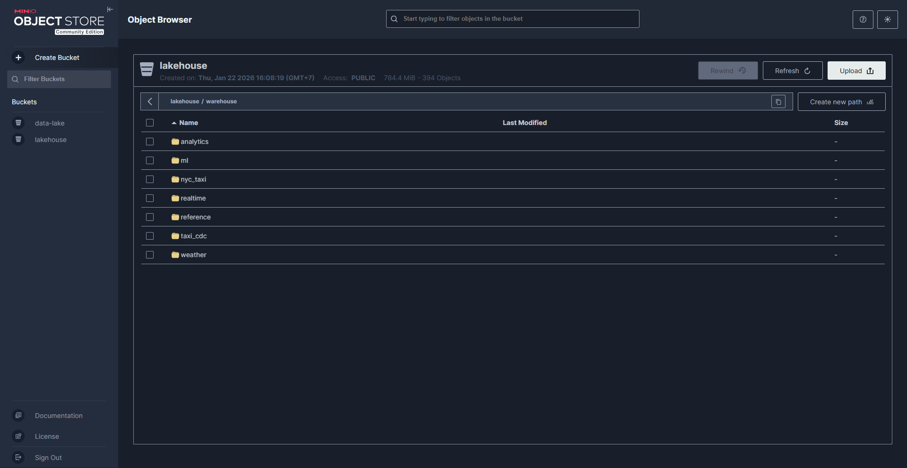

# NYC Taxi Data Lakehouse

A modern data lakehouse built for analytics and machine learning on NYC taxi data combined with weather information. It integrates taxi trip data with weather conditions to enable powerful predictive analytics and insights.



## Overview

This project ingests Yellow Taxi Trip Records from NYC Taxi Data and enriches them with real-time weather information from Open-Meteo, processes the combined dataset using Apache Spark, stores it in Apache Iceberg tables, and provides ML features and Analytics through a REST API and interactive dashboard.

- **Data Ingestion**: Batch ingestion of monthly taxi data and real-time weather feeds
- **Data Processing**: Apache Spark ETL jobs with complex transformations including weather joins
- **Data Storage**: Apache Iceberg tables stored in MinIO (S3-compatible) with weather-enriched datasets
- **Change Data Capture**: Kafka-based CDC for source database changes
- **Orchestration**: Apache Airflow for job scheduling and dependency management
- **API & Dashboard**: FastAPI backend with Streamlit dashboard for data exploration with weather insights
- **ML Features**: ML feature engineering pipeline for predictive analytics leveraging weather patterns

## Components

### Airflow DAGs
Located in `airflow/dags/`:
- **nyc_taxi_iceberg_etl.py**: Main ETL pipeline for NYC taxi data
- **weather_iceberg_etl.py**: Weather data ingestion and integration
- **comprehensive_analytics_etl.py**: Comprehensive analytics and ML features engineering

### Spark Jobs
Located in `spark_jobs/`:
- **nyc_taxi_to_iceberg.py**: Taxi data processing
- **weather_to_iceberg.py**: Weather data processing
- **cdc_processor.py**: Real-time CDC events processing
- **create_iceberg_cdc_tables.py**: CDC table initialization
- **location_to_iceberg.py**: Geographic data processing
- **ml_feature_engineering.py**: ML feature generation
- **comprehensive_analytics.py**: Complex analytical transformations

### Data Services
Located in `serving/`:
- **api.py**: FastAPI REST endpoints for data access
- **dashboard.py**: Streamlit interactive dashboard
- **database.py**: Database connectivity and queries
- **models.py**: Data models and schemas

### Supporting Services
- **Data Generator** (`data-generator/`): Generates synthetic taxi data for testing and CDC
- **Data Backfill** (`data-backfill/`): Historical data loading utilities
- **CDC Configuration** (`data-crawler/`): Debezium kafka connector setup

## Prerequisites

- Docker & Docker Compose
- Python 3.8+
- Java 11+ (for Spark)
- Git

## Quick Start

### 1. Clone the Repository
```bash
git clone <repository-url>
cd "NYC Taxi Data Lakehouse"
```

### 2. Start All Services
```bash
docker-compose up -d
```

This will start:
- PostgreSQL database
- MinIO object storage
- Kafka
- Kafka Connect (Debezium)
- Apache Spark
- Apache Airflow
- FastAPI serving layer
- Streamlit dashboard

### 3. Start CDC processor
```bash
# Start processor for CDC
./spark-cdc-processor.sh
```

### 4. Access Web Interfaces
- Dashboard: http://localhost:8501 



- Airflow Webserver: http://localhost:8085 



- MinIO Console: http://localhost:9001 




## License

This project is provided as-is for educational and demonstration purposes.

## Contact

For questions or issues, please refer to the project documentation or create an issue in the repository.
